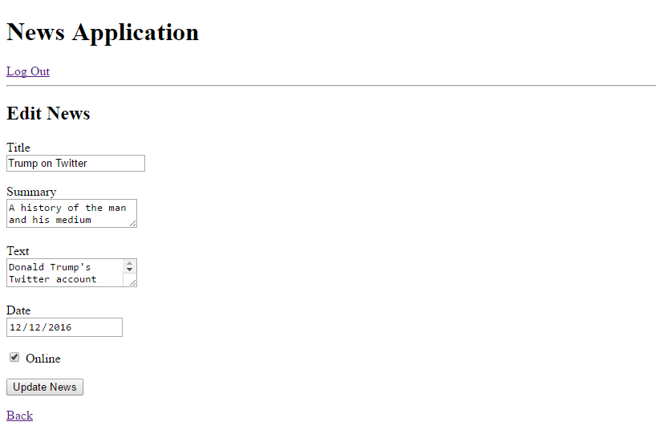

# Simple News Application

Just a project to showcase my understanding of how to use Ruby and Rails! 
It uses Devise for user authentication, and stores all data in MySQL.

## Screenshots

Landing Page:

Sign In:

Sign Up:

Successful Sign In:

Creating News:

News Listing:

Editing News:

